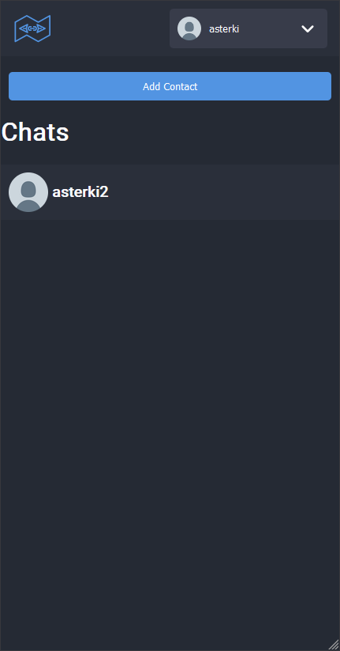
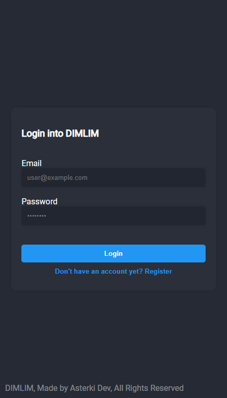
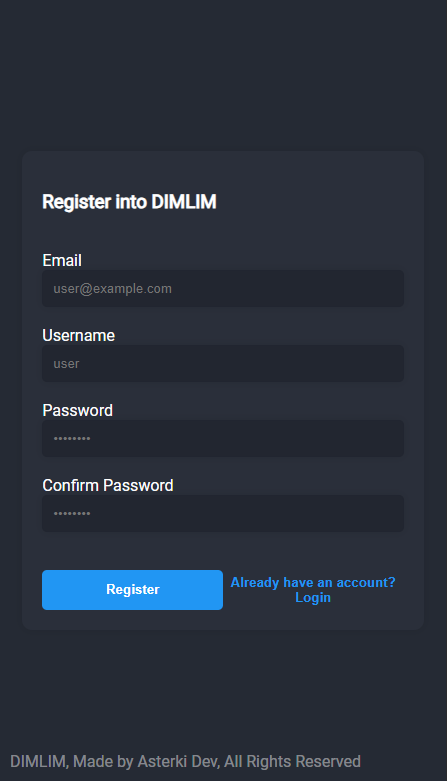
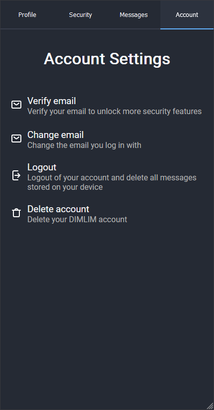
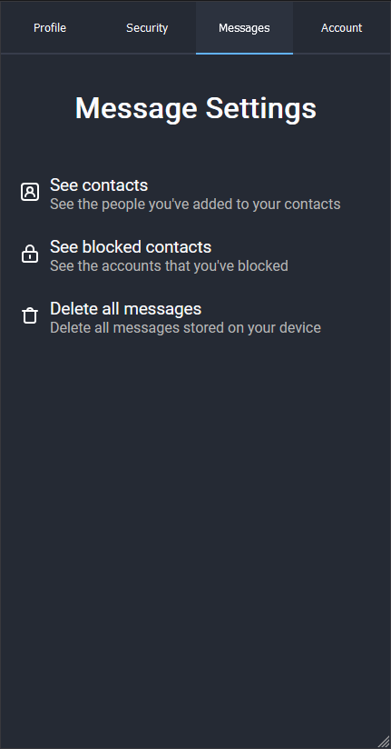
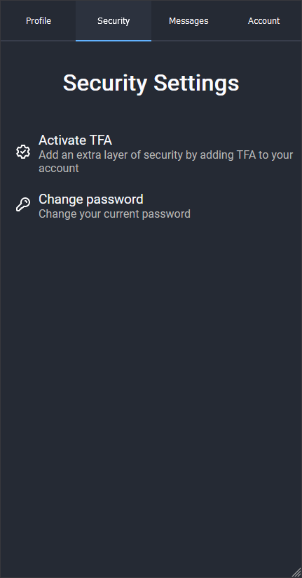

# DIMLIM

DIMLIM is an end-to-end encryption chat app currently in progress. With DIMLIM, you can securely chat with your friends and family without worrying about your conversations being intercepted by third parties or even the same server.

## Features

- End-to-end encryption to ensure secure messaging
- Ability to send text messages, images, and videos
- Push notifications to ensure you never miss a message
- User profile customization options to make your account unique
- Ability to block unwanted contacts to prevent them from messaging you

## In Progress

- Option to delete messages from both sender and receiver's device
- Group chat functionality to easily communicate with multiple people
- Voice and video call functionality
- GIF support for more expressive messaging
- Integration with other encrypted messaging apps
- Ability to share documents and other file types

**We regret to inform that the current code of our app may not accurately reflect the features that were previously mentioned. The app is currently being refactored to improve its performance and security.**

## Table of Contents
- [DIMLIM](#dimlim)
  - [Features](#features)
  - [In Progress](#in-progress)
  - [Table of Contents](#table-of-contents)
- [Screenshots](#screenshots)
  - [Chat](#chat)
  - [Account](#account)
  - [Settings](#settings)
- [Setup](#setup)
  - [Requirements](#requirements)
  - [Environment Variables](#environment-variables)
  - [Running on development mode](#running-on-development-mode)
  - [Running on production mode](#running-on-production-mode)
- [Technologies Used](#technologies-used)
  - [Frontend](#frontend)
  - [Backend](#backend)
- [Extra information](#extra-information)
  - [Borwsers tested in](#borwsers-tested-in)
  - [Operative systems tested in](#operative-systems-tested-in)
- [License](#license)

<br>
<br>

# Screenshots
## Chat


## Account



## Settings





# Setup

Ensure that you have the requirements, installed dependencies, and have set the environment variables before you run the code

## Requirements
- Node >v18.13.0
- MongoDB >4.4 
- Linux, macOS or WSL (Recommended)
- NPM >8.19.3 

<br>

## Environment Variables
The following variables must be stored in a file named `.env.local`, these variables are prone to change
| Variable             | Description                                             | Required | Default              |
|----------------------|---------------------------------------------------------|----------|----------------------|
| MONGODB_URI          | MongoDB URI String                                      | false    | mongodb://127.0.0.1/ |
| PORT                 | The port client will listen to in production mode       | false    | 8080                 |
| SESSION_SECRET       | The secret the sessions will be encrypted with          | true     | No Default           |
| COOKIE_SECURE        | Wether the cookie is under HTTPS or not                 | false    | false                |
| COOKIE_MAX_AGE       | How long the sessions will last (in milliseconds)       | false    | 604800000            |
| SERVER_PORT          | The port the server will listen to on dev and prod mode | false    | 3030                 |

<br>

## Running on development mode

On a terminal, run the following command
```bash
$ npm run dev
``` 

Then you can access the site at the specified port

<br>

## Running on production mode

On a console, run the following command:
```bash
$ npm run start
``` 

This will automatically build and run the server on production mode

<br>
<br>

# Technologies Used
If you want to edit the code, you may want to be familiar with the following programming languages and libraries

## Frontend
- TSX
- Next.js
- Redux
- SCSS

<br>

## Backend
- TypeScript
- Node.js
- Express.js
- Mongoose
- Passport.js

<br>
<br>

# Extra information

## Borwsers tested in
     
<br>

## Operative systems tested in

    

<br>
<br>

# License

Copyright 2023 Fernando Rivera

Permission is hereby granted, free of charge, to any person obtaining a copy of this software and associated documentation files (the "Software"), to deal in the Software without restriction, including without limitation the rights to use, copy, modify, merge, publish, distribute, sublicense, and/or sell copies of the Software, and to permit persons to whom the Software is furnished to do so, subject to the following conditions:

The above copyright notice and this permission notice shall be included in all copies or substantial portions of the Software.

THE SOFTWARE IS PROVIDED "AS IS", WITHOUT WARRANTY OF ANY KIND, EXPRESS OR IMPLIED, INCLUDING BUT NOT LIMITED TO THE WARRANTIES OF MERCHANTABILITY, FITNESS FOR A PARTICULAR PURPOSE AND NONINFRINGEMENT. IN NO EVENT SHALL THE AUTHORS OR COPYRIGHT HOLDERS BE LIABLE FOR ANY CLAIM, DAMAGES OR OTHER LIABILITY, WHETHER IN AN ACTION OF CONTRACT, TORT OR OTHERWISE, ARISING FROM, OUT OF OR IN CONNECTION WITH THE SOFTWARE OR THE USE OR OTHER DEALINGS IN THE SOFTWARE.
